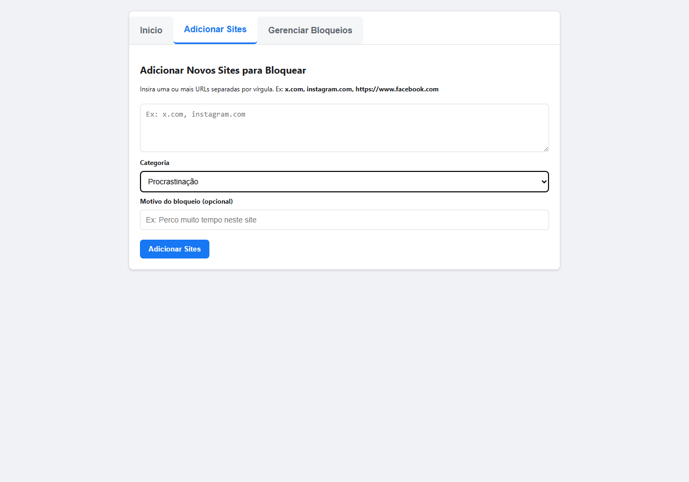
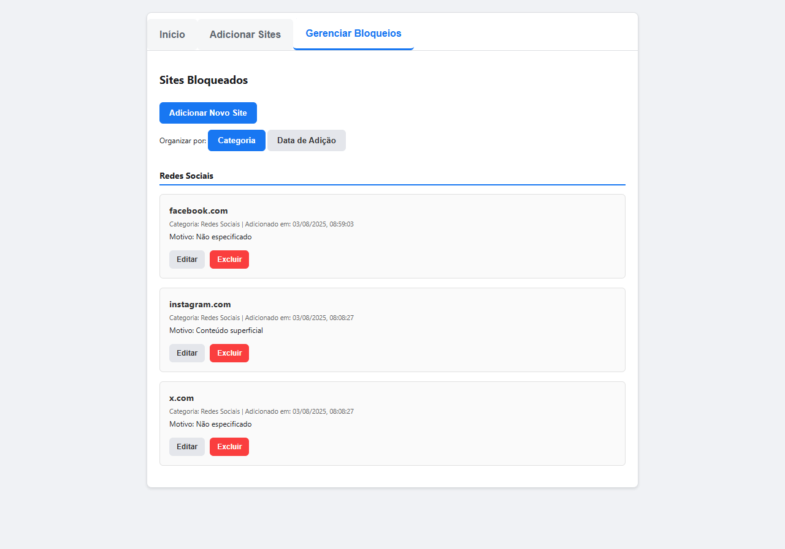
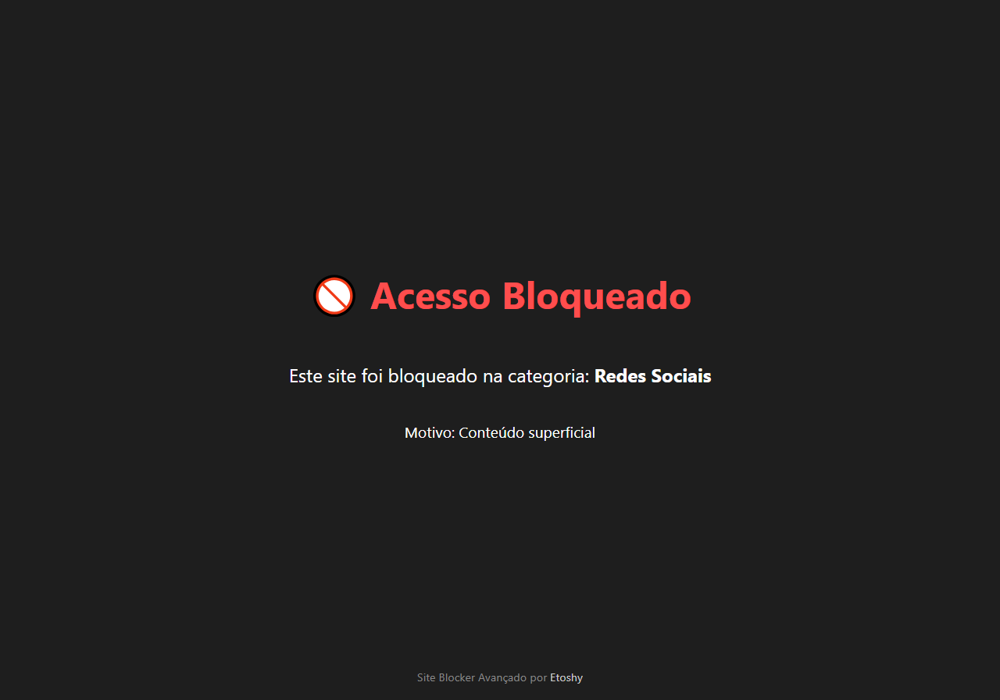

# Site Blocker Extension

Uma extensão de navegador de código aberto, criada para ajudar você a recuperar o foco e aumentar a produtividade, oferecendo controle total sobre os sites que você pode acessar.

## Sobre o Projeto

Em um mundo digital cheio de distrações, manter o foco é um desafio. O **Site Blocker Avançado** nasceu da necessidade de uma ferramenta simples, mas poderosa, para gerenciar hábitos de navegação. Diferente de outros bloqueadores, ele foi projetado para ser flexível e transparente, permitindo que o usuário personalize completamente sua experiência de bloqueio com categorias e motivos, reforçando o compromisso com seus próprios objetivos.

Este projeto é 100% de código aberto, focado na privacidade do usuário e construído com tecnologias web padrão.

## Funcionalidades Principais

-   **Bloqueio por Categorias:** Agrupe sites em categorias como "Redes Sociais", "Procrastinação" ou crie as suas próprias.
-   **Motivos Personalizados:** Adicione um motivo para cada bloqueio para se lembrar do porquê você está evitando aquele site.
-   **Painel de Controle Completo:** Gerencie todos os seus bloqueios em uma interface limpa e organizada, com abas para facilitar a navegação.
-   **Adição em Massa:** Adicione múltiplos sites de uma vez, separando-os por vírgula.
-   **Edição Flexível:** Edite qualquer informação de um site bloqueado (URL, categoria, motivo) a qualquer momento através de um modal intuitivo.
-   **Visualização Dupla:** Organize sua lista de bloqueios por categoria ou por data de adição.
-   **Foco Total em Privacidade:** Nenhum dado é coletado ou enviado a servidores externos. Tudo fica armazenado localmente no seu navegador.

## Galeria

**Painel de Controle**

**Página de Bloqueio**

## Como Funciona (Estrutura Técnica)

A extensão é construída com tecnologias web padrão (HTML, CSS, JavaScript) e utiliza as APIs do Chrome para funcionar.

-   **`manifest.json`**: O coração da extensão. Define o nome, a versão, as permissões necessárias e os scripts principais.
    -   **`permissions`**: Solicita acesso a `storage` (para salvar a lista de bloqueios), `tabs` (para abrir a página de opções) e `scripting` (para injetar o código de bloqueio).
    -   **`host_permissions`**: A permissão `<all_urls>` é essencial para que a extensão possa verificar a URL de qualquer página que o usuário visite e decidir se deve bloqueá-la.

-   **`background.js`**: Um script simples que "escuta" o clique no ícone da extensão e executa o comando `chrome.runtime.openOptionsPage()` para abrir o painel de controle em uma nova aba.

-   **`options.html` / `options.js`**: O painel de controle do usuário.
    -   `options.html`: Define a estrutura da interface com abas, formulários, listas e o modal de edição, usando HTML e CSS.
    -   `options.js`: Contém toda a lógica da interface. Ele é responsável por:
        -   Renderizar a lista de sites bloqueados.
        -   Processar a adição, edição e exclusão de sites.
        -   Gerenciar a lógica das abas e dos modos de visualização.
        -   Interagir com o `chrome.storage.sync` para ler e salvar os dados.

-   **`content.js`**: O script que realiza o bloqueio.
    -   É injetado em todas as páginas que o usuário visita, graças à permissão `<all_urls>`.
    -   Ele obtém a URL da página atual (`window.location.hostname`), normaliza-a e verifica se ela existe na lista de sites bloqueados salva no `chrome.storage.sync`.
    -   Se houver uma correspondência, ele interrompe o carregamento da página (`window.stop()`) e substitui o conteúdo do `<body>` pela mensagem de bloqueio personalizada.

-   **`chrome.storage.sync`**: O "banco de dados" da extensão. É uma API do Chrome que permite salvar dados de forma persistente. A opção `sync` foi escolhida para que as configurações do usuário possam ser sincronizadas entre diferentes dispositivos onde ele esteja logado com a mesma conta Google, garantindo uma experiência consistente.

## Instalação

### Para Desenvolvedores

Se você deseja testar, modificar ou contribuir para o projeto:

1.  Faça o clone deste repositório: `git clone https://github.com/etoshy/Site-Blocker-Extension.git`
2.  Abra o Google Chrome e acesse `chrome://extensions`.
3.  Ative o "Modo do desenvolvedor" no canto superior direito.
4.  Clique em "Carregar sem compactação".
5.  Selecione a pasta do projeto que você clonou.
6.  A extensão estará instalada e pronta para ser testada!

## Como Contribuir

Contribuições são muito bem-vindas! Se você tem uma ideia para uma nova funcionalidade, encontrou um bug ou quer melhorar a interface, sinta-se à vontade para contribuir.

1.  **Fork** este repositório.
2.  Crie uma nova branch para sua feature (`git checkout -b feature/minha-feature`).
3.  Faça o commit das suas alterações (`git commit -m 'Adiciona minha feature'`).
4.  Faça o push para a sua branch (`git push origin feature/minha-feature`).
5.  Abra um **Pull Request**.

## Licença

Este projeto está licenciado sob a Licença MIT.

---

Desenvolvido com ❤️ por [Etoshy](https://github.com/etoshy).
